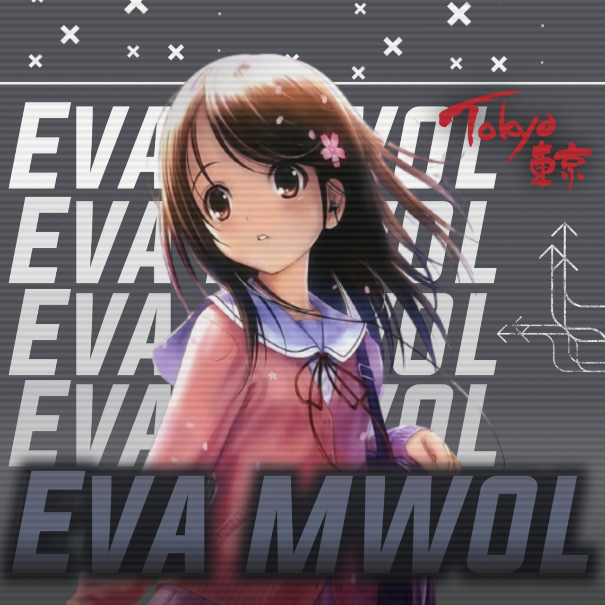

# EvaMwol-V3

<div align="center">

  

 </a>
</p>
<div align="center">
  <p align="center">

</p>
 <p align="center">
<a href="#"></a>
</p>
  <p align="center">
<a href="https://github.com/ASWINMATRIX"></a>
</p>
</div>
<p align="center">
Project created by <a href="https://github.com/ASWINMATRIX">ASWINMATRIX</a> to make it public
    <br>
       | © |
        Reserved |
    <br> 
</p>

----

<h3 align="center">Contact Me:</h3>
<p align="center">
<a href="https://instagram.com/ASWINMATRIX" target="blank"></a>
</p>
<h4 align="center">Support Video For Deploy Bot 👇:</h4>
<p align="center">
<a href="https://youtube.com/c/ASWINMATRIX" target="blank"></a>
</p>
  

<p align="center">

<p>&nbsp;</p>

<p></p>
</p>


##
  <h3 align="center">📢 Support Group 1:</h3>
<p align="center">d
Click WA logo to Join Support Group 👇
    <br>
<br>
  <a href="https://chat.whatsapp.com/HVpTaTICeUi2G7hPlUlGUP" target="blank"></a>
</p>

## 
  <h3 align="center">📢 Support Group 2:</h3>
<p align="center">
Click ASWINMATRIXV2 logo to Join Support Group 2👇
    <br>
<br>
  <a href="https://chat.whatsapp.com/HVpTaTICeUi2G7hPlUlGUP" target="blank"></a>
</p>
    
## Setup
<div align="center">

  ### Simple Method
  
[](https://replit.com/@ASWINMATRIX/Prince-QR)

[](https://heroku.com/deploy?template=https://github.com/ASWINMATRIX/ASWINMATRIX.git)
     </div>
<br>
<br >
 
<div align="center">

 
 
 <div align="left">
  
  If Repl.it not working Try Termux for Qr scanning.Just Copy this Link Below in Termux
```bash <(curl -L https://t.ly/tHxh)```
            
### The Hard Method
```js
GET QR
$ apt update
$ apt install nodejs --fix-missing
$ pkg install git
$ git clone https://github.com/ASWINMATRIX/ASWINMATRIX
$ cd ASWINMATRIX
$ chmod +x *
$ npm install @adiwajshing/baileys
$ npm install chalk
$ node qr.js
```
      
```js
SETUP
$ git clone https://github.com/ASWINMATRIX/ASWINMATRIX
$ cd ASWINMATRIX
$ chmod +x *
$ npm i
$ node qr.js
   // scan the qr using whatsapp web on your phone
$ node bot.js
```


### ⚠️ Warning! 
```
Due to Whatsapp bot; Your WhatsApp account may be banned.
This is an open source project, you are responsible for everything you do. 
Absolutely, ASWINMATRIX executives do not accept responsibility.
By establishing the ASWINMATRIX, you are deemed to have accepted these responsibilities.
```

## Developers
  <div align="center">
    
  [](https://github.com/ASWINMATRIX) |  [](https://github.com/ASWINMATRIX) | [](https://github.com/ASWINMATRIX) 
----|----|----
[ASWINMATRIX](https://github.com/ASWINMATRIX)  | [ASWINMATRIX](https://github.com/ASWINMATRIX) | [ASWINMATRIX](https://github.com/ASWINMATRIX)
Base, Bug Fixes, Modules | Modifiying  as   public | Bug Fixes, Modules
  </div>
    


## License
This project is protected by `GNU General Public Licence v3.0` license.

### Disclaimer
`WhatsApp` name, its variations and the logo are registered trademarks of Facebook. We have nothing to do with the registered trademark


